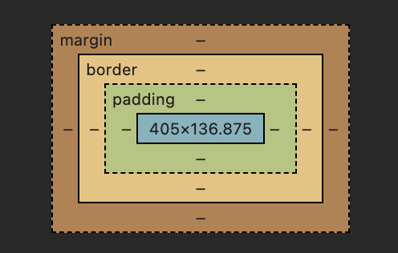

# Assignment 2

## Part 1 Url (ttt1.html)
https://shaka3507.github.io/assignment2/ttt1.html

## Part 2 Url (ttt2.html)
https://shaka3507.github.io/assignment2/ttt2.html

## Part 3
### Q: Identify an area of CSS code you feel really good about – and indicate why.

I feel comfortable working with the CSS box model - specifically identifying and adding padding, margin and borders to add to elements. I believe I'm comfortable working with the box model because I work with Chrome developer tools often and often rely on the responsive box model display they provide for you. Having the margin, border and padding visible and illustrated to you with colors helps cement which values control what for certain elements.

An area that is still a challenge for me is centering elements horizontally and vertically, within certain contexts. It's something I consistently have to trouble shoot in the Chrome developer tools style sheet and something I could use more practice with.